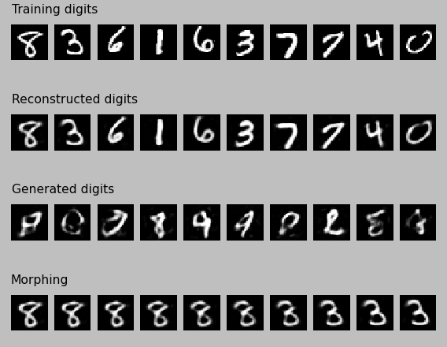

# Morphing with autoencoders

Simple demonstration on how to do morphing using autoencoders.
The morphing between two images (e.g., digits) is performed as follows:

1. learn an autoencoder from data
2. get the codes of the two images with the autoencoder
3. compute a weighted average of the codes with weights alpha and (1-alpha), where 0<alpha<1
4. plot the reconstruction of the new code using the autoencoder

###Requirements

```
tensorflow
numpy
```  


###How to run

```python morphing_mnist.py```  

Note: the script plots the morphing while it learns the autoencoder.
Therefore, wait few seconds to see better "morphing" results.

